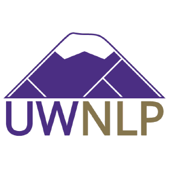

# DialGenModel 

The offical PyTorch implementation of the models used in DialGen paper. Please refer to our paper for details.

**DIALGEN: Collaborative Human-LM Generated Dialogues for Improved Understanding of Human-Human Conversations**.

[Bo-Ru Lu](https://nlp.borulu.com/)<sup>1*</sup>, Nikita Haduong<sup>1*</sup>, [Chia-Hsuan Lee](https://chiahsuan156.github.io/)<sup>1</sup>, [Zeqiu Wu](http://ellenmellon.github.io/)<sup>1</sup>, [Hao Cheng](https://sites.google.com/site/hcheng2site/Home)<sup>2</sup>, Paul Koester<sup>3</sup>, Jean Utke<sup>3</sup>, [Tao Yu](https://taoyds.github.io)<sup>4</sup>, [Noah A. Smith](https://nasmith.github.io/)<sup>1,5</sup> and [Mari Ostendorf](https://people.ece.uw.edu/ostendorf/)<sup>1</sup>. <sup>\*</sup>Equal Contribution</span>

<sup>1</sup>University of Washington</span> <sup>2</sup>Microsoft Research</span> <sup>3</sup>Allstate</span> <sup>4</sup>University of Hong Kong</span> <sup>5</sup>Allen Institute for AI</span>

[[project]](https://nlp.borulu.com/DialGen/) [[data]](https://github.com/boru-roylu/DialGenModel/tree/main/dialgen_data/v1.0) [[model]](https://github.com/boru-roylu/DialGenModel/tree/main) [[paper]](https://arxiv.org/abs/2307.07047) [[interface]](https://github.com/boru-roylu/DialGenFramework)

This code has been written using PyTorch >= 1.13 and HuggingFace >= 4.27.3. If you use our source codes included in this repository in your work, please cite the following paper. The bibtex is listed below:

```text
@misc{lu2023dialgen,
      title={DIALGEN: Collaborative Human-LM Generated Dialogues for Improved Understanding of Human-Human Conversations},
      author={Bo-Ru Lu and Nikita Haduong and Chia-Hsuan Lee and Zeqiu Wu and Hao Cheng and Paul Koester and Jean Utke and Tao Yu and Noah A. Smith and Mari Ostendorf},
      year={2023},
      eprint={2307.07047},
      archivePrefix={arXiv},
      primaryClass={cs.CL}
}
```

## Experiment Results

| Method     | $CB_{avg}$ | $CB_1$ | $CB_2$ | $CB_3$ | $CB_4$ | $TLB$ |
| ---------- | :--------: | :----: | :----: | :----: | :----: | :---: |
| IC-DST     |    71.3    |  71.9  |  68.5  |  68.4  |  68.2  | 68.1  |
| T5         |    76.8    |  78.4  |  74.9  |  73.7  |  74.1  | 73.9  |
| T5-SC      |    78.2    |  79.3  |  76.4  |  76.6  |  76.9  | 74.2  |
| T5-SC $\S$ |    78.5    |  78.7  |  76.2  |  76.0  |  76.2  | 75.0  |

The released data is with name substitution. All reported values represent the medians obtained from 5 different
random seeds. $\S$: T5-SC model on data with name substitution.

## Environment Setup

- Download T5 and LongT5 models.

  ```bash
  # T5-base
  python src/download_model.py --model_name t5-base --output_dir ./pretrained_models
  ```

  ```bash
  # Long T5
  python src/download_model.py --model_name google/long-t5-tglobal-base --output_dir ./pretrained_models
  ```

## Data and Experiment Setup

Raw data is here: `dialgen_data/v1.0`.

- T5 TLB.

  ```bash
  bash scripts/setup.sh tlb t5 ./dialgen_data/v1.0/tlb
  ```

- LongT5 DST

  ```bash
  bash scripts/setup.sh dst longt5 ./dialgen_data/v1.0/dst
  ```

- T5 SC
  We use most recent 18 turns to create the previous state here.
  ```bash
  bash scripts/setup.sh sc t5 ./dialgen_data/v1.0/state_change/18_turns
  ```

## Run the script for training and evaluation.

- T5 TLB

  ```bash
  # We use the test file in longt5-dst as reference.
  # The test file is a softlink, it points to the original file.
  bash scripts/run_t5-tlb.sh ./data/t5-tlb 42 ./pretrained_models/google/long-t5-tglobal-base ./data/longt5-dst
  ```

- LongT5 DST

  ```bash
  bash scripts/run_t5-tlb.sh ./data/longt5-dst 42 ./pretrained_models/t5-base ./data/longt5-dst
  ```

- T5 SC
  ```bash
  # Limited by the max number of input tokens, we use the last 18 turns to create
  # the previous state.
  # Training time is about 2 hours.
  bash scripts/run_t5-sc.sh ./data/t5-sc 42 ./pretrained_models/t5-base ./data/t5-tlb ./data/longt5-dst 18
  ```
